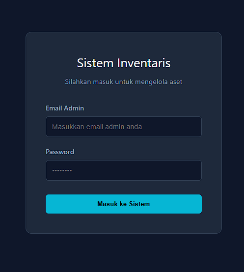
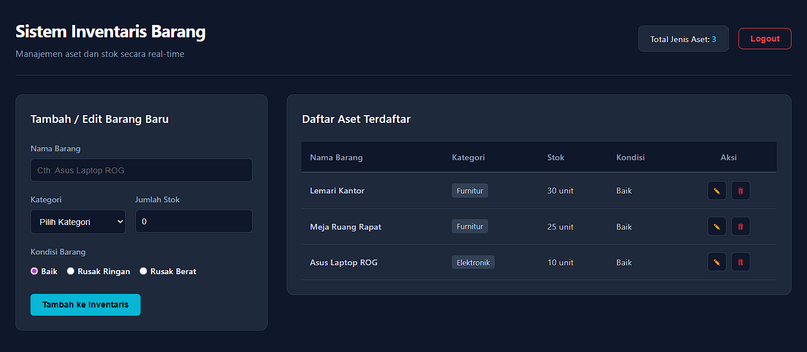

# 📦 Sistem Inventaris Barang (Inventory Management System)

Sebuah aplikasi web *Single Page Application* (SPA) modern untuk mengelola pencatatan aset dan inventaris secara *real-time*. Dibangun menggunakan **Vue.js 3 (Composition API)** dan **Supabase**, aplikasi ini dirancang dengan antarmuka *minimalist dark-mode* yang berfokus pada kecepatan, keamanan, dan *User Experience* (UX) yang optimal.

---

## ✨ Fitur Utama (Key Features)

- **🔐 Autentikasi Aman:** Sistem login khusus Admin menggunakan Supabase Auth (Email & Password) dengan proteksi *Navigation Guards* (Vue Router) untuk mengamankan *dashboard*.
- **⚡ Operasi CRUD Real-time:** Menambah, membaca, mengedit, dan menghapus data aset yang langsung tersinkronisasi dengan *database* Supabase.
- **🎨 UI/UX Modern & Responsif:** - Mengusung tema *Dark Mode* yang profesional dan bersih.
  - Implementasi **Custom Dynamic Modal** untuk konfirmasi aksi destruktif (seperti menghapus data atau *logout*), menggantikan *alert* bawaan *browser* yang kaku.
  - Implementasi **Toast Notification** (*Snackbar*) dengan animasi *slide-in* untuk memberikan umpan balik (sukses/gagal) tanpa memblokir interaksi pengguna.
- **🛡️ State & Error Handling:** Mencegah *Race Condition* saat autentikasi dan memvalidasi *input* form secara *real-time*.

---

## 🛠️ Teknologi yang Digunakan (Tech Stack)

- **Front-End Framework:** [Vue.js 3](https://vuejs.org/) (Composition API, `<script setup>`)
- **Routing:** [Vue Router 4](https://router.vuejs.org/)
- **Build Tool:** [Vite](https://vitejs.dev/) (Untuk kompilasi super cepat)
- **Back-End as a Service (BaaS) / Database:** [Supabase](https://supabase.com/) (PostgreSQL & GoTrue Auth)
- **Styling:** Custom CSS3 (Modern Minimalist Dark Theme)

---

## 📸 Pratinjau Antarmuka (Screenshots)




---

## 🚀 Cara Menjalankan Proyek secara Lokal (Local Setup)

Untuk menjalankan aplikasi ini di komputer lokal, pastikan Anda sudah menginstal **Node.js** terlebih dahulu.

**1. Clone repositori ini**
```bash
git clone [https://github.com/USERNAME_GITHUB_KAMU/nama-repo-kamu.git](https://github.com/USERNAME_GITHUB_KAMU/nama-repo-kamu.git)
```

**2. Masuk ke Direktori Proyek**
```bash
cd CRUD-VUE-PROJECT
```

**3. Instal semua dependensi (dependencies)**
```bash
npm install
```

**4. Konfigurasi Environment Variables**<br>
Buat file .env di direktori utama (root) dan tambahkan kredensial Supabase Anda:
```bash
VITE_SUPABASE_URL=masukkan_url_supabase_anda_disini
VITE_SUPABASE_ANON_KEY=masukkan_anon_key_supabase_anda_disini
```

**5. Jalankan server pengembangan (development server)**
```bash
npm run dev
```
Buka browser dan akses alamat lokal yang diberikan oleh Vite (biasanya http://localhost:5173).

## 💡 Developer Notes & Pembelajaran
Proyek ini dibangun untuk mendemonstrasikan pemahaman mendalam tentang arsitektur Front-End modern, termasuk:
<ul>
  <li>Penerapan pola desain Asynchronous Javascript (async/await) untuk berkomunikasi dengan REST API secara efisien.</li>
  <li>Manajemen State reaktif menggunakan ref di Vue 3.</li>
  <li>Konsep Prinsip DRY (Don't Repeat Yourself) dalam membangun komponen antarmuka yang dinamis, seperti Dynamic Modal yang dapat berubah wujud sesuai konteks interaksi (Logout / Delete).</li>
  <li>Penyelesaian bug tingkat lanjut seperti Race Condition pada alur autentikasi Single Page Application.</li>
</ul>
